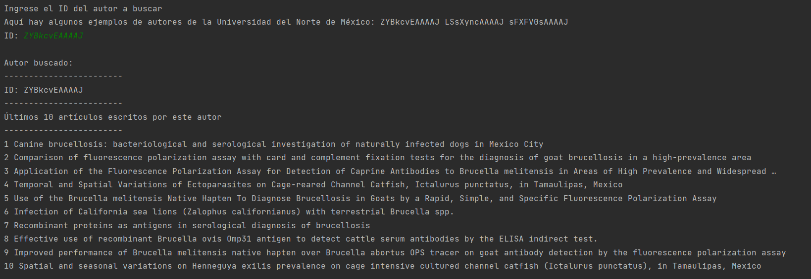

## Documentación de la API de Google Scholar

La API de Google Scholar permite tener acceso a la base de datos de Google Scholar, una base de datos con trabajos académicos y científicos. Cubre diferentes áreas, como estudios de la salud, sociales, etc., y por ello es muy útil para el propósito del proyecto del dream team. Además, brinda información sobre trabajos académicos, como artículos, tesis y patentes, así como también sobre los autores y las revistas científicas.

El dream team utilizará Google Scholar Author como motor de búsqueda, y el request necesario para acceder a esa API es de tipo GET, utilizando como baseURL “https://serpapi.com/search?engine=google_scholar_author”. Sin embargo, esto no es suficiente, pues el request necesita ciertos parámetros que detallo a continuación:

### Query Params

La Google Scholar API admite varios query params, que permiten personalizar la búsqueda. Algunos de los más comunes son los siguientes:

1. `api_key`: Se necesita tener una clave de la API. 
2. `q`: Hace referencia a la cadena de búsqueda.
3. `author_id`: Es el ID del autor a buscar.
4. `engine`: Como ya dijimos, el URL debe contener "engine=google_scholar_author".

También utilizaremos otros parámetros, aunque no son estrictamente necesarios:

1. `hl`: Para especificar el idioma. En el caso de español latinoamericano, es "es-419".
2. `num`: Para limitar el número de resultados.

### Requests

La petición que podemos realizar a la Google Scholar Author API es de tipo GET, utilizando la baseURL que detallamos anteriormente, sumado a los parámetros que deseamos agregar, finalmente el endpoint sería:

`https://serpapi.com/search?engine=google_scholar_author&q={authorId}&autho_id={authorId}&hl=es-419&num=10&api_key={apiKey}`

### Response

La respuesta de la Google Scholar Author API puede encontrarse en dos formatos diferentes: **`json`** o **`html`**. Por defecto vendrá en formato JSON, pero si quisiéramos la respuesta en HTML, basta con agregar un parámetro más, llamado **`output`**. Para obtener el HTML en bruto recuperado, el código es el siguiente **`&output=html`**.

 La respuesta, si utilizamos a partir de los **`organic_results`**, se vería de la siguiente manera:

```json
{
      "position": 1,
      "title": "Carlos Ramirez-Pfeiffer",
      "link": "https://scholar.google.com/citations?user=ZYBkcvEAAAAJ&hl=en",
      "displayed_link": "https://scholar.google.com › citations › user=ZYBkcv...",
      "snippet": "Effective use of recombinant Brucella ovis Omp31 antigen to detect cattle serum antibodies by the ELISA indirect test. MC Navarro-Soto, R Gomez-Flores, A ...",
      "about_this_result": {
        "source": {
          "description": "Google Scholar is a freely accessible web search engine that indexes the full text or metadata of scholarly literature across an array of publishing formats and disciplines.",
          "source_info_link": "https://scholar.google.com/citations?user=ZYBkcvEAAAAJ&hl=en",
          "security": "secure",
          "icon": "https://serpapi.com/searches/643ef1b18e02e47d1ea6d784/images/fc4aed5723645ec1cb561875dc161d65eef525842a3c6ac046fcab587b6f63a0c56ef88f162e755976b783ce18b071d1.png"
        }
      },
}
```

Para el propósito del dream team, iteraremos sobre el array de objetos **`organic_results`**, utilizando solo los campos **`title`**, **`link`** y **`snippet`** para el output. El formato de la salida, entonces, seguiría el siguiente modelo:

“Autor: ” + **`title`**

”Enlace: “ + **`link`**

”Descripción: “ + **`snippet`**

### Ejemplo práctico de esta aplicación de consola

Luego de correr nuestra aplicación de consola, se le pedirá al usuario que ingrese el ID del autor que desea buscar, dejando algunos ejemplos a la mano.


Al ingresar un ID y dar Enter, obtendremos la respuesta (hasta 10 resultados):

